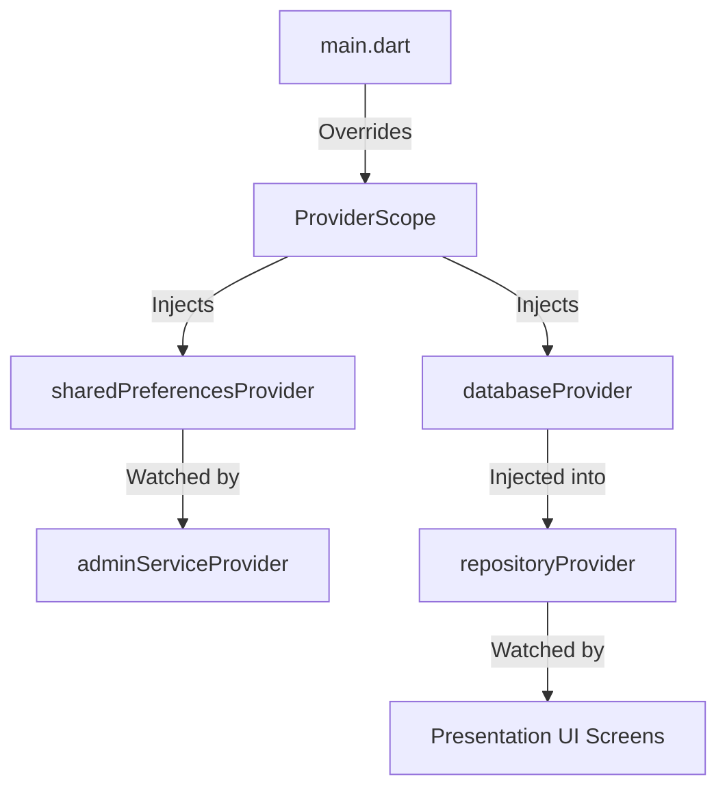

# Clean Architecture & Engineering Guide - ShinkaTrack

ShinkaTrack is engineered using **Clean Architecture** patterns combined with **Flutter Riverpod** for state management and **Drift** (SQLite) for high-performance offline storage.

---

## 1. Directory Structure
The codebase is structured around feature-based modules:

```text
lib/
│
├── core/                        # Application-wide global utilities and infrastructure
│   ├── database/                # Drift database definitions and migrations
│   ├── navigation/              # GoRouter configurations and layout shells
│   ├── services/                # Global services (notifications, admin service, etc.)
│   └── theme/                   # Material 3 typography and design system colors
│
└── features/                    # Independent domain modules
    ├── dashboard/               # Main layout and study tracker progress dials
    ├── study/                   # Kanji and dictionary collection, CRUD admin screens
    ├── timer/                   # Active study sessions timer and notifications
    ├── quiz/                    # Evaluation assessments, quiz scores logs
    ├── analytics/               # Progress summaries, XP leveling stats logs
    └── settings/                # Preferences and Developer Options panel
```

Each feature module is organized into three Clean Architecture layers:
1. **Domain**: Abstract entities, repository interfaces, and use-case boundaries.
2. **Data**: Concrete repository implementations, model parsers, and database access logic.
3. **Presentation**: Widgets, screens, and Riverpod providers managing UI state.

---

## 2. Dependency Injection & Service Integration
ShinkaTrack avoids the use of global variables. Instead, it relies on Riverpod's dependency injection system:

* **SharedPreferences**: Loaded asynchronously in `main.dart` and injected into `sharedPreferencesProvider`.
* **Database instance**: Declared via `databaseProvider` to expose the single compiled `AppDatabase`.
* **Repositories**: Exposed through a `repositoryProvider` interface mapping implementation classes.
* **Services**: Global instances (e.g. `adminServiceProvider`, `NotificationService`) watch core providers to maintain decoupling.



---

## 3. State Management & Flow
* **UI Updates**: Presentation widgets watch Riverpod selectors (`ref.watch`) to listen for specific properties.
* **Data Mutation Flow**:
  1. The user interacts with the UI (e.g., taps "Add to Collection").
  2. The widget calls the respective notifier (e.g. `ref.read(kanjiListProvider.notifier).addToCollection(id)`).
  3. The notifier executes the async repository query.
  4. Upon success, the notifier updates its internal immutable state.
  5. Riverpod triggers a micro-rebuild on any widgets watching the updated parameters.

---

## 4. SQLite Database Architecture (Drift)
* **Migrations**: Incremental schema updates are managed inside `onUpgrade` using SQLite raw commands or structural Drift migrations wrapped inside SQLite transactions.
* **Performance Optimizations**:
  * List queries execute LEFT OUTER JOINs between `MasterKanjis` and `UserKanjis` to construct unified entities.
  * Fields like `kanji` and `jlptLevel` are strictly indexed to ensure instant search returns (under 16ms) across thousands of rows.

---

## 5. Routing (GoRouter)
* Routes are declared inside [router.dart](file:///e:/Web%20Development/Shin/lib/core/navigation/router.dart).
* Navigation is handled using context extensions (e.g., `context.push()`).
* Dynamic query parameters (e.g., `/kanji_details?id=k5`) are parsed inside builders to instanciate screens with explicit dependencies.

---

## 6. Testing Strategy
* **Unit Tests**: Test data serialization models, SRS scheduling algorithms, and `AdminService` hashing routines.
* **Widget/UI Tests**: Verify UI state changes (e.g. tapping Settings version 7 times triggers snackbars and displays hidden tiles).
* **Integration Tests**: Verify end-to-end database updates, migrations from version 3 to 4, and backup exports/restorations.
